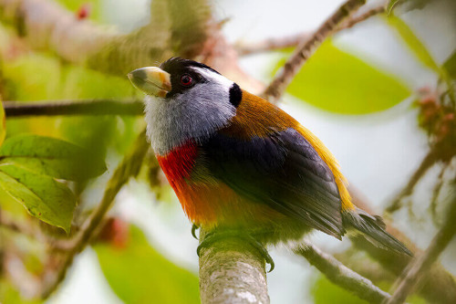

# Helcor

General Purpose JavaScript Tools.

| Package | Description |
| :------------- | :------------- |
| [`@helcor/merge-collections`](./packages/merge-collections) | Merge two arrays of objects by identifier. |
| [`@helcor/move-in-array`](./packages/move-in-array) | Move an item by position in a list of positionated items. |
| [`@helcor/throttle`](./packages/throttle) | Create rate-limit controlled functions. |
| [`@helcor/window-sizes`](./packages/window-sizes) | Browser window dimensions and sizes manipulation. |

## About

Helcor's logo is a photo of a bird named Toucan Barbet Compas endemic from Colombia.

A frugivorous colorful bird only found in the humid forests of western Colombia.
No sexual dimorphism as both sexes are very similar. Frugivorous and also preys
on insects and pierce flowers for nectar.

Source: [birdsofcolombia.com](https://birdsofcolombia.com).
